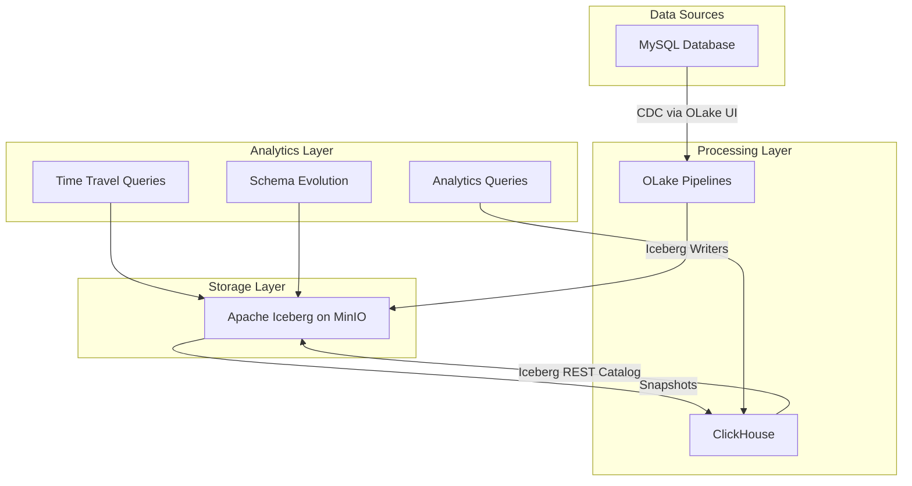

# Building a Data Lakehouse with Apache Iceberg, ClickHouse & OLake UI

A comprehensive Docker-based development environment that ingests data from MySQL into MinIO-backed Apache Iceberg tables via the **OLake** and queries the lakehouse with ClickHouse. The repo walks through the full pipeline—MySQL CDC ➜ OLake ➜ Iceberg on MinIO ➜ ClickHouse analytics.

## 🏗️ Architecture Overview



## 🎯 What This Demo Showcases

### Core Features
- **ClickHouse Experimental Iceberg Support** - Query Iceberg tables through the REST catalog interface
- **Real-time CDC Pipeline** - MySQL → OLake → Iceberg with change data capture
- **Silver/Gold Acceleration** - Materialize ClickHouse-optimized tables on top of raw Iceberg data
- **Schema Evolution** - Add columns and modify schemas without data loss
- **Time Travel Queries** - Query historical data states
- **Partition Pruning** - Optimized query performance with intelligent partitioning

### Integration Components
- **MySQL 8.0** - Source database with sample e-commerce data
- **ClickHouse 24.11** - Analytics database with experimental Iceberg support
- **MinIO** - S3-compatible object storage for Iceberg tables
- **OLake** - Data lake orchestration and CDC platform
- **PostgreSQL** - Metadata store for OLake

## 🚀 Quick Start

```bash
git clone <this-repo>
cd clickhouse-mysql-olake-demo
docker-compose up -d
```

- Services: MySQL, MinIO, ClickHouse, PostgreSQL helper components
- Bring your own OLake UI + REST catalog (see blog for full walkthrough)
- Detailed instructions live in `BLOG_POST_COMPLETE_WALKTHROUGH.md`

## 🧭 Next Steps

1. Launch OLake UI per [official docs](https://olake.io/docs/)
2. Follow the blog to configure source/destination, run the pipeline, and query via ClickHouse
3. Re-run `scripts/iceberg-setup.sql` + `scripts/cross-database-analytics.sql` whenever you load new data

For troubleshooting, scripts, and the full hands-on guide, jump into `BLOG_POST_COMPLETE_WALKTHROUGH.md`.
